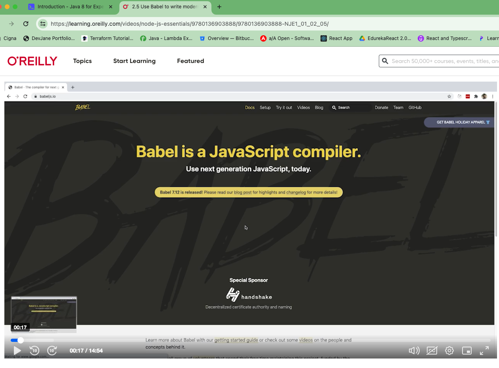
code traspiler - 
support older 

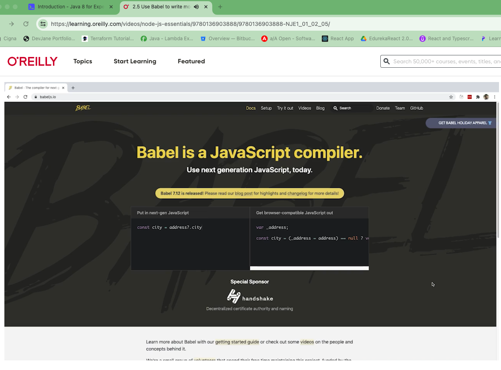 
Wite in modren js and transpile into nodejs runnable code

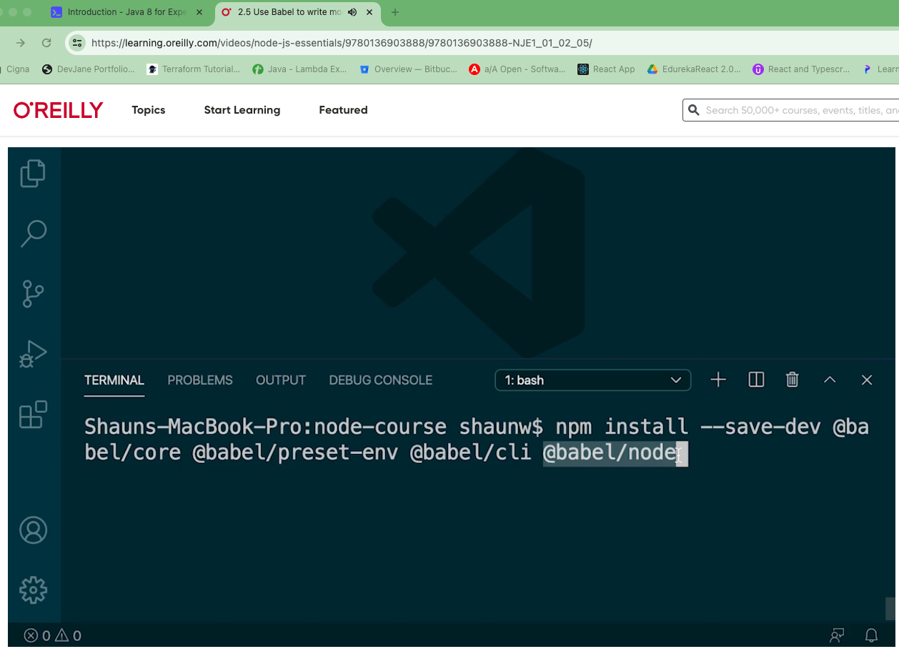
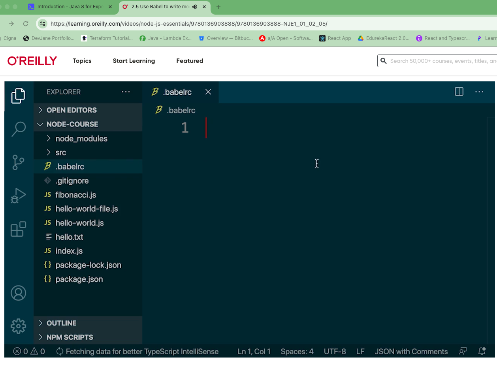 similar to eslintrc file

Defining presets 
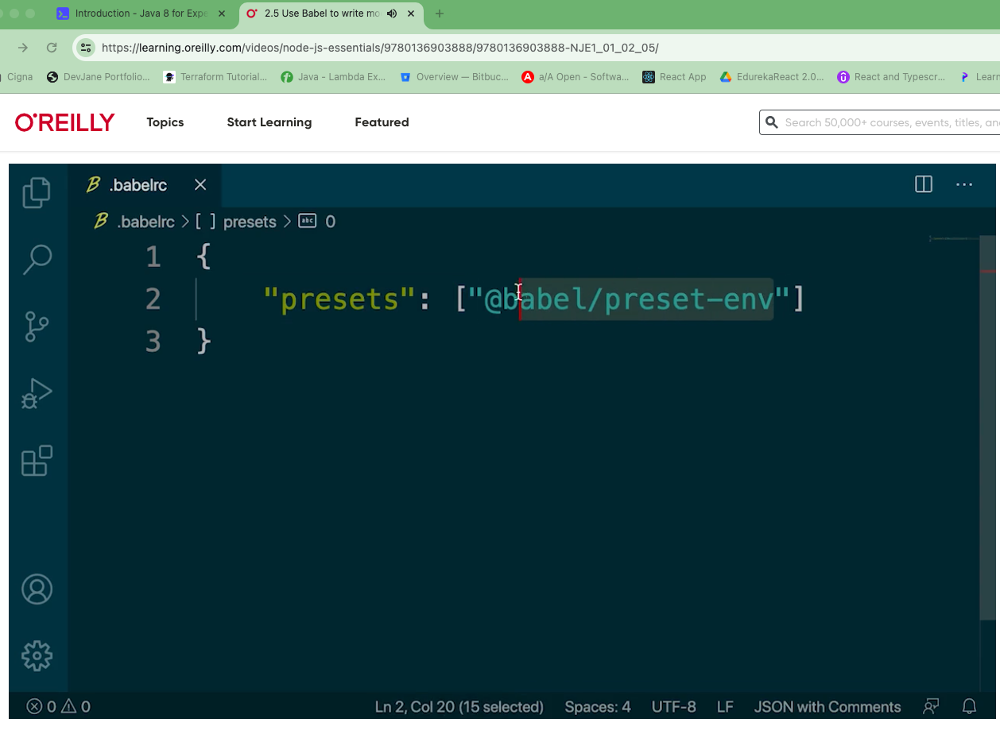

npx babel-node ./index.js
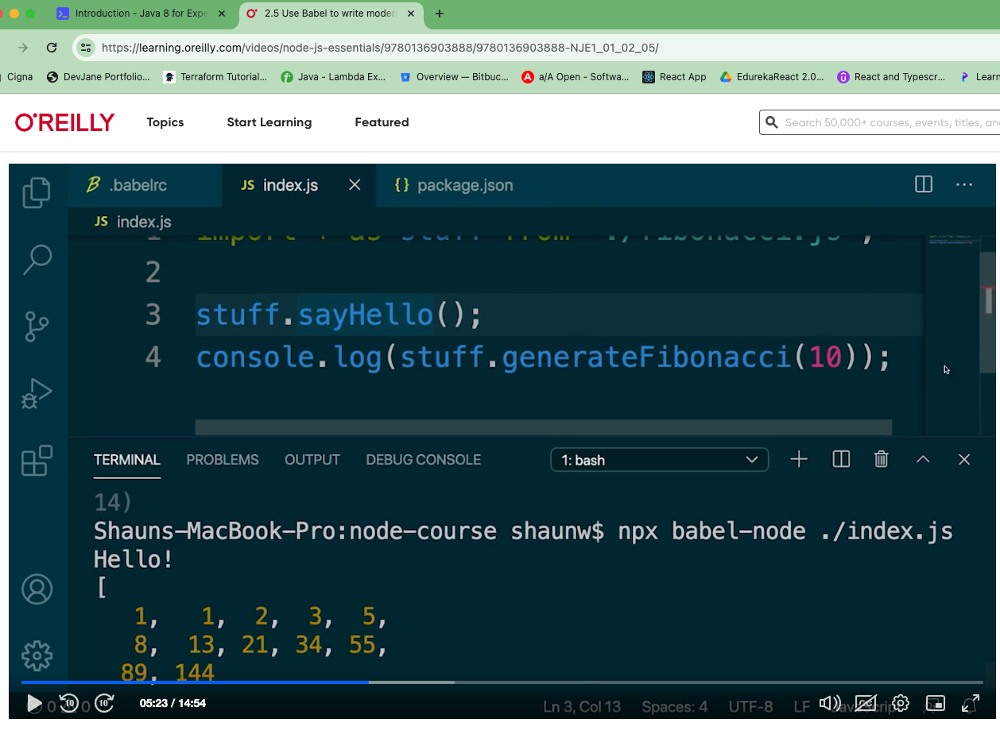

transpile in memory and it uses run the nodejs file  as normal execution

# getting transpile files 
 

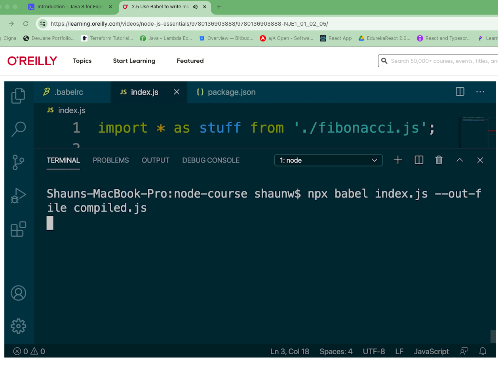
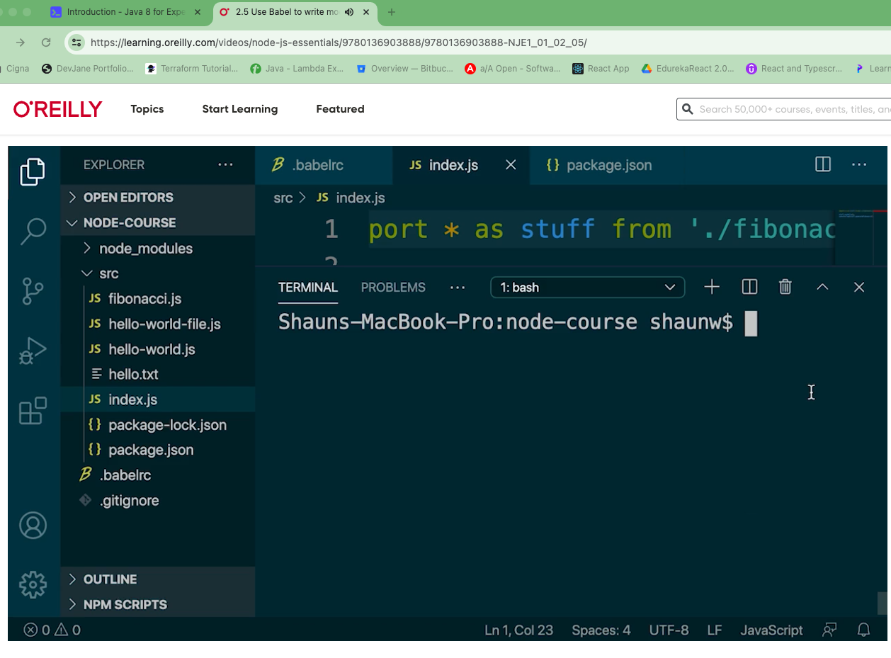

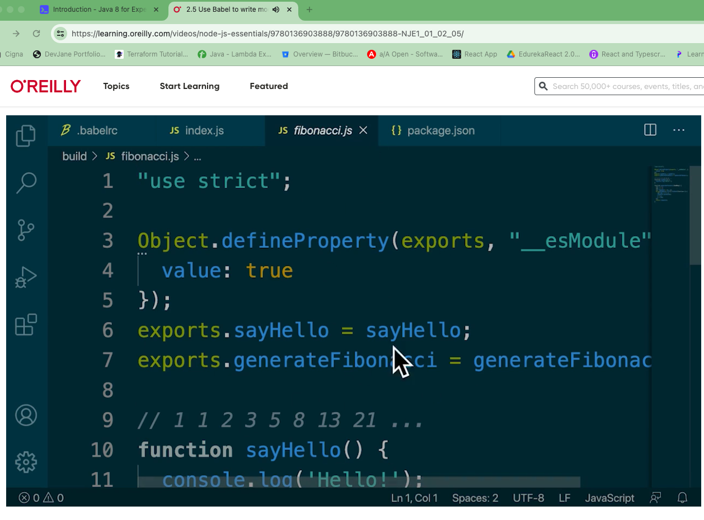
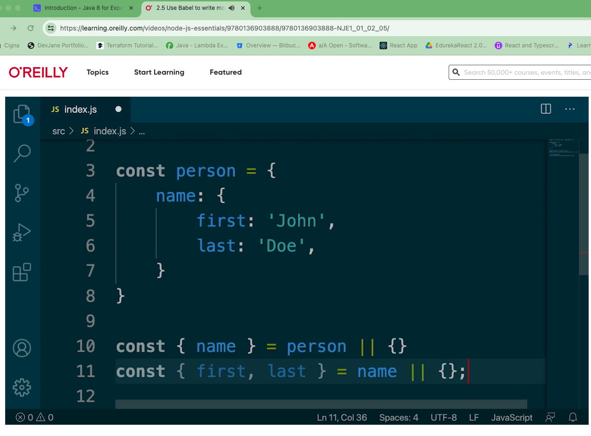
optional chain -- plugin

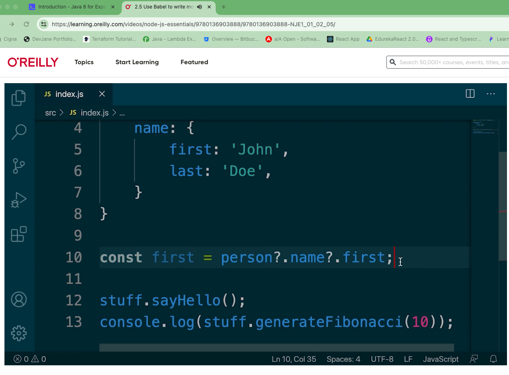
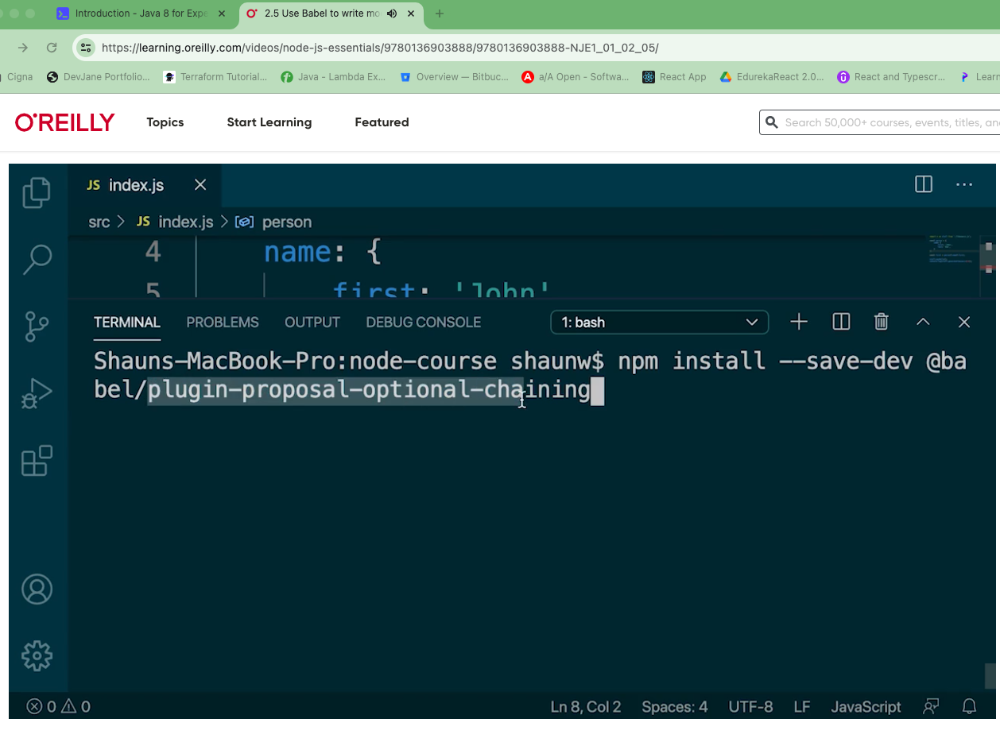
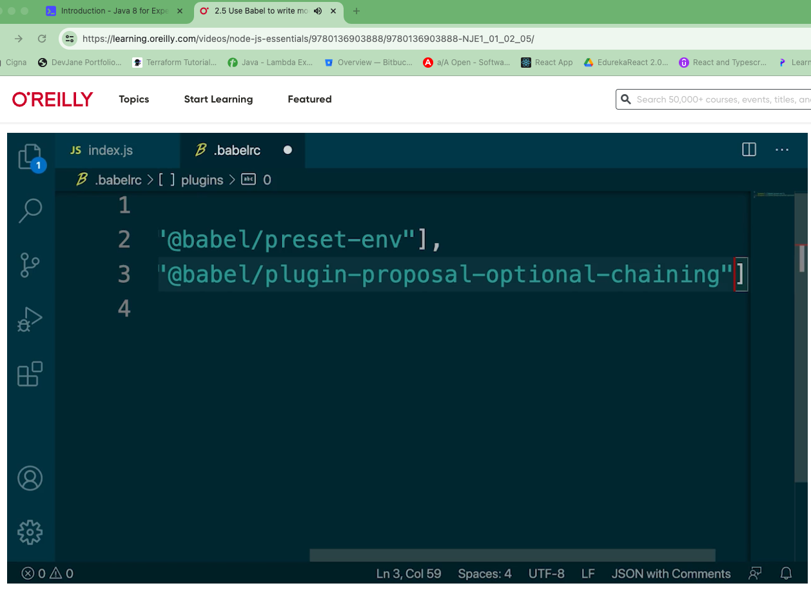

