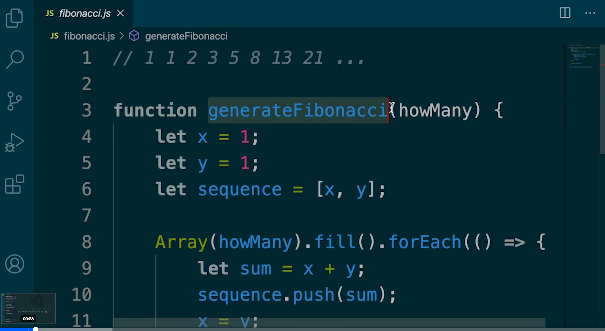
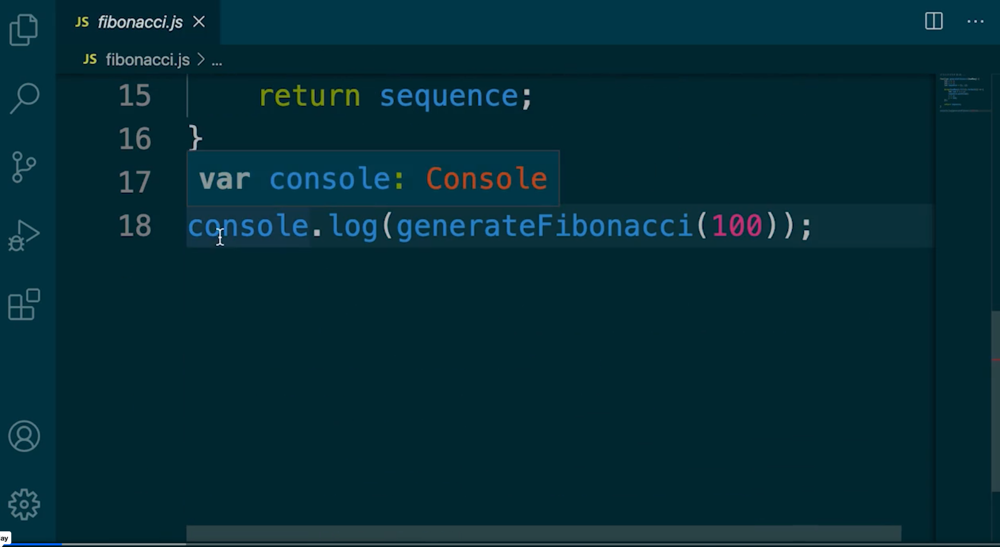
remove hadcoded number for the method ()
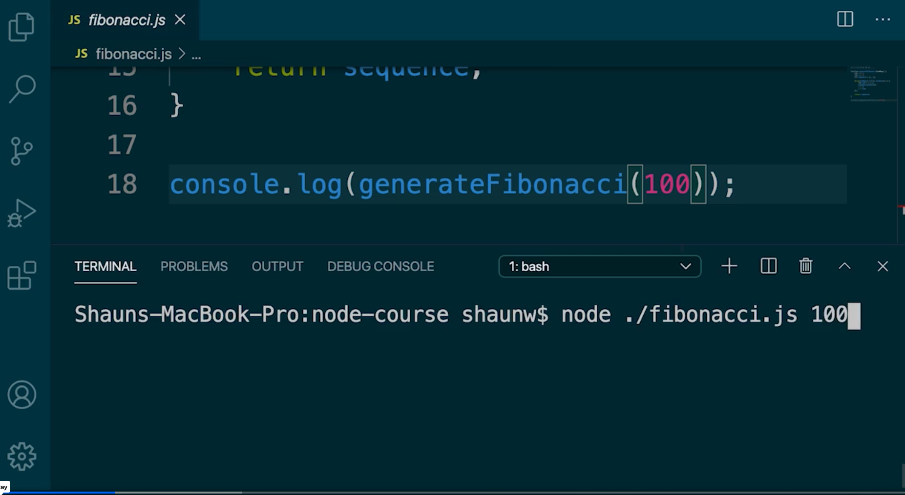
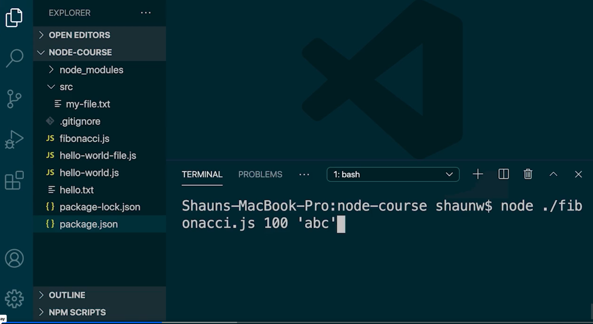
when user pass node ./fibonacci.js 100 'abc'
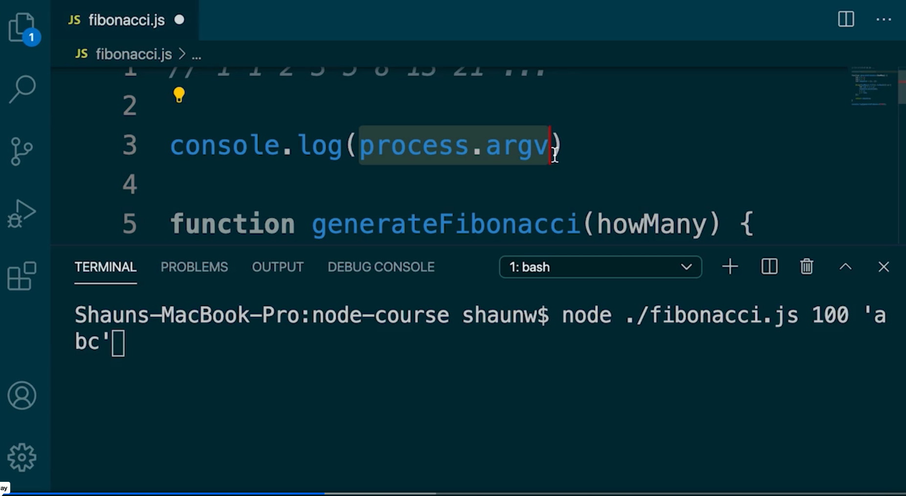
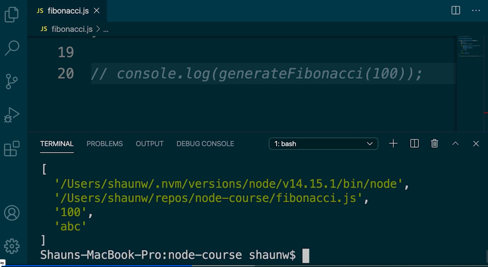
Process.argv contains  array which has following
1 as node (path to node)
2 as the file name: fibonacci.js ( having absolute path)
3 is the 100 param
4 is the abc

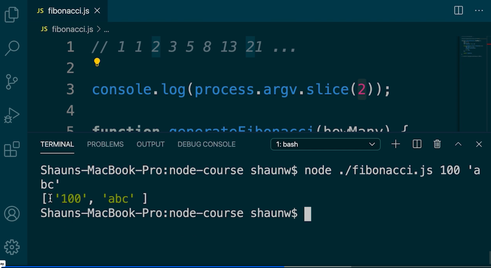
will provide 100, abc
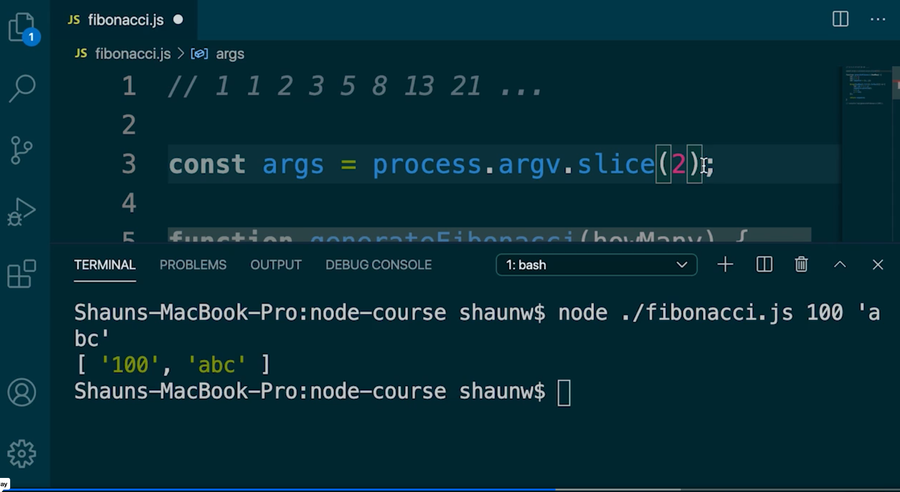
const args = process.argv.slice(2); - which will contain all the user passed arguments
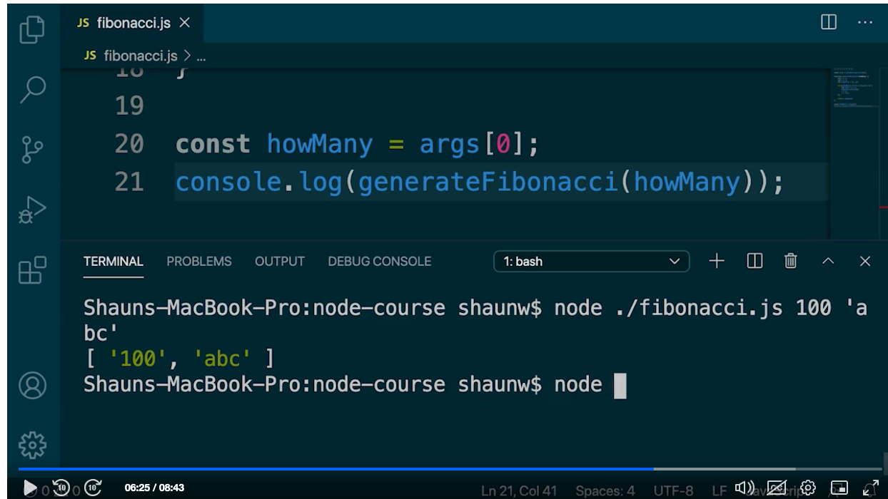
const howMany = args[0];
console.log(generateFibonacci(howMany))
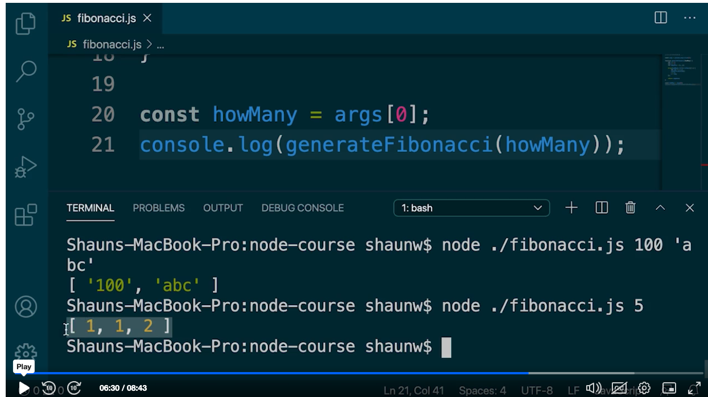 when node ./fibonacci.js 5 still views unexacted results since the args are consider as strings
hence we need to conver the follow line to number
const howMany = Number(args[0]);
console.log(generateFinonnacci(howMany))
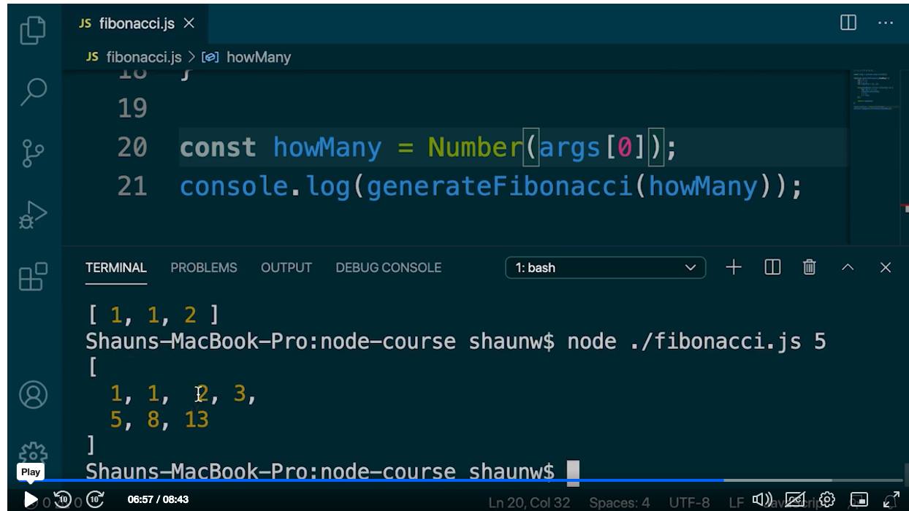 this time it generate 5 numbers
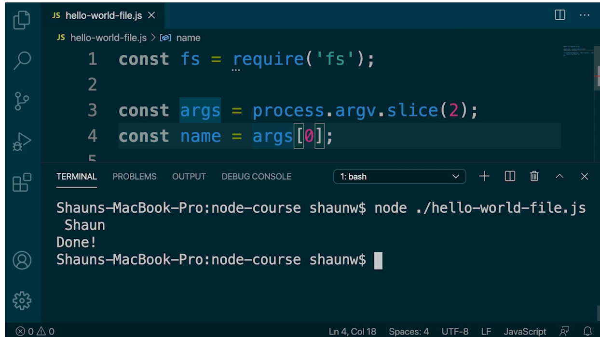

