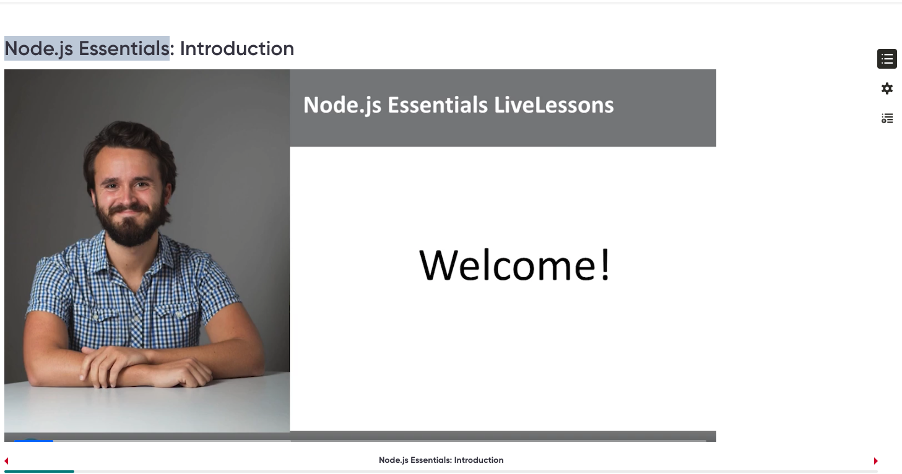

# Git Repo

Shaun Wassell
https://github.com/shaunwa/node-course/tree/main/src/basic-node-examples

MERN
MEAN
MEVN
AWS
API, IAM, Cognito, Security Manager, Lambda, DynamoDB, SNS, SQS, Stepfunction, CloudWatch, CloudTrail, Event Bridge, Athena, Glue, AWS CDK, Cloudformation, Terraform, Docker, Kubternetes-EKS, 

Python
.Net